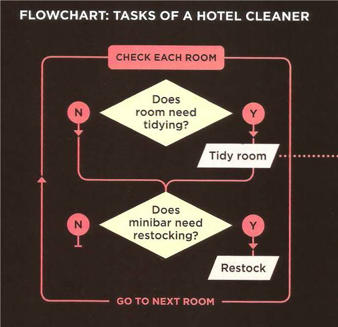
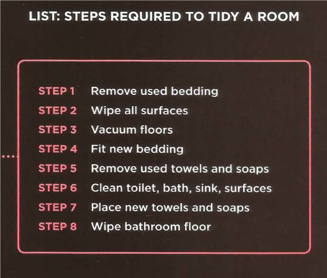

# JavaScript
It is a high-level, dynamically typed, interpreted programming language. JavaScript is used to add dynamic features and functions to our web page. These are some functionality JavaScript can do:
*	Accessing content and attributes of both CSS and HTML code.
*	Modifying the content of a web page 
*	Programming and give instructions to the web page to follow
*	React to events when it was triggered by the user or by different program
JavaScript can be used to interact and make the web page alive. The most common examples you could see JavaScript involved are in slideshows, forms, reload part of the page, and filter data.
## What is a script? 
It is a set of rules and instructions that tells the computer how to operate. We can see many examples resample the script in our real life: Like a recipe, for example where you can write the steps to how to make a dish or food, as well as in a device manual where the manufacturer explain the machine’s internal components and how to fix it if they brock down. 
## How can I write the script?
Machines, like computers, can not understand human language as a human can learn them very quickly. We have to tell the computers these instructions step by step and break them into small tasks to work and do the job just like we want. 
Following are simple steps you can apply when writing a script to any task:
### 1.	Define the script goal:
You should know precisely what the script should be for and what you will be using it for.

### 2.	Design the script:
This can be achieved by dividing the job into smaller tasks; then, you may draw a flow chart illustrating these tasks from the beginning to the end.  

Next, you need to write a descriptive set of instructions to perform these individual tasks.

### 3.	Now you write your code:
Computers do not understand human language, so they need to be told what to do with a language they can understand. And just like any other language, it contains vocabulary and syntax. However, learning these will not help you know how computers work and how you write the code in a programmatic approach. You also have to learn to think logically like computers.

## Sketching out the flow chart:
You can use different schemes to sketch your flowchart, yet there is a special way programmers agreed upon to ensure uniformity in drawing a flow  chart. For example, they decided to represent events with a special shape and other input and output options with other shapes. 
 
## Expressions and Operators 
All programming languages involve expressions and operators in order to perform arithmetic and math operations or other logical operations.
### Expressions:
In JavaScript, expressions are divided into two main types: Assignment expressions and Return value expressions.
Assignment expressions include giving values to variables, and they only involve one value.
Returning value expressions require more than one constant or value and usually involve calculation or mathematical operation.
### Operations:
Expressions rely on operators so that they can yield one value from more than one value. The types of operations we can do in any expression depend on the data type included inside the expression.

 
*	Assignment operators.
*	Arithmetic operators.
*	Comparison operators.
*	Logical operators.
*	String operators.

 
They also depend on the precedence and the order of the execution of these operators.
