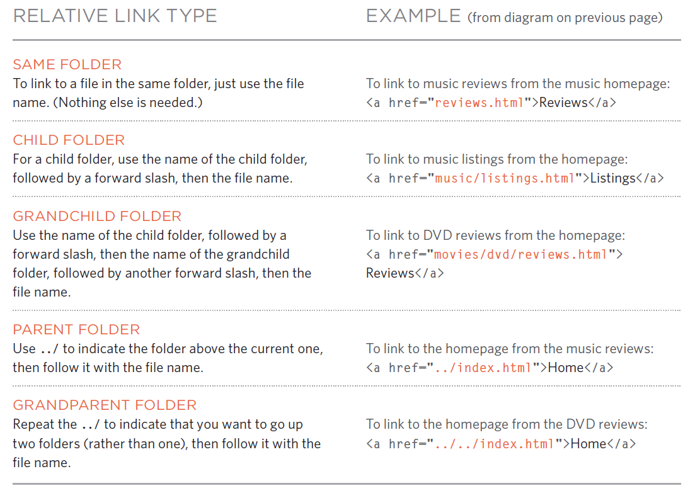

# HTML Links - CSS Layouts - JavaScript Functions, Methods, and Objects

## HTML Links

The web relies on linking to other sites or web pages on the same site. Therefore, we need an element to link to other web pages, which is the \<a> element.

### The link element

It contains both opening and closing tags. The opening tag has to take the `href:` attribute. This attribute tells the browser where to go when the user clicks on it. We must also write a liable link text between the opening and the closing tag, which will be the text that will appear to the user to tell them where they go. But, before we dive deeper on what we can link to, let us talk about addresses.

#### Absolute adress

When we want to link to a web page that is not on our site, we must provide the full address, which is called absolute address. We have to write the hypertext protocol and the world wide web acronym, and then we specify the domain and the rest of the path to the desired page.

```html

<p>Movie Reviews:
    <ul>
        <li><a href="http://www.empireonline.com">
            Empire</a></li>
        <li><a href="http://www.metacritic.com">
            Metacritic</a></li>
        <li><a href="http://www.rottentomatoes.com">
            Rotten Tomatoes</a></li>
        <li><a href="http://www.variety.com">
            Variety</a></li>
    </ul>
</p>

```

#### Relative address

When we link to a page on our website, we do not provide the full address with the domain name; we only provide the address relative to our web page from the root directory.

```html

<p>
    <ul>
        <li><a href="index.html">Home</a></li>
        <li><a href="about-us.html">About</a></li>
        <li><a href="movies.html">Movies</a></li>
        <li><a href="contact.html">Contact</a></li>
    </ul>
</p>

```



### Linking to email

We can link to an email address using the `meailto:`keyword inside the href attribute, then providing the email address. This will force the browser to open the mailing software with the type email as a template to the user.

```html

<a href="mailto:jon@example.org">Email Jon</a>

```

### Linking to specific content on the page

You can add the ID attribute to the content to where you want the link to move to, and inside the href, add the # with the ID of the content.

```html

<h1 id="top">Film-Making Terms</h1>
<a href="#arc_shot">Arc Shot</a><br />
<a href="#interlude">Interlude</a><br />
<a href="#prologue">Prologue</a><br /><br />
<h2 id="arc_shot">Arc Shot</h2>
<p>A shot in which the subject is photographed by an
encircling or moving camera</p>
<h2 id="interlude">Interlude</h2>
<p>A brief, intervening film scene or sequence, not
specifically tied to the plot, that appears
within a film</p>
<h2 id="prologue">Prologue</h2>
<p>A speech, preface, introduction, or brief scene
preceding the the main action or plot of a film;
contrast to epilogue</p>
<p><a href="#top">Top</a></p>

```

### Opening the link in a separate window

You can specify a `target`attribute to the value `_blanck`to open the link in a separate window.

```html

<a href="http://www.imdb.com" target="_blank">
Internet Movie Database</a> (opens in new window)

```

## CSS Layouts

When designing a web page, it is different from designing a page to print or a poster to anything else. Web pages are flexible and can grow and shrink according to the screen's size. Therefore, when designing your web page, you have to know the core principles for positioning and layout your element on the screen to appear the same way you intended before publishing your website on all kinds of devices. Let us start with the first core concept:

### Blook and Inline

To understand HTML's elements, we have to sort them according to how these elements appear on a wen page. They can appear either on a block-level, meaning that they take a new line and take the whole screen width. You can control the width and height of this kind of element.
Examples: p, h1, h2, div, ul, ol, and li.

The second type is Inline level elements. These elements appear on the same line as the previous content, and they only take the width of their content. However, unlike block elements, inline elements must be converted to different display types to change their size.
Examples: a, img, label, button, em, and strong.

### Containing elements

We inevitably enclose groups of elements inside divs, so it will be easier for you to position them. When you put a group of elements inside a div or other block-level element, the outer container is called the parent element.

### Positions

In CSS, There are five positioning schemes:

#### Static

Static is the most basic one. It positions the elements as they originally would appear if no CSS positioning applied to the page, as to how would HTML position page elements on top of one another. Every block-level element appears on a new line pushing all other elements underneath it down.

```css
/* this code was taken form Duckatt CSS book */
body {
width: 750px;
font-family: Arial, Verdana, sans-serif;
color: #665544;}
h1 {
position: static;
background-color: #efefef;
padding: 10px;}
p {
position: static;
width: 450px;}

```

#### Relative

Relative positioning does not take the element out of the normal flow. Thus element still holds its position on the page, but you can reposition the element relative to its previous position inside the containing. If you moved an element to flow over other elements, it would overlap with other elements without affecting their original position.

Note: To position the element after you change the position property, you can use the offset properties to change the element's position on the screen. Offset are: top, bottom, left, right.

```css
/* This code was taken from Duckett CSS book */

p.example {
position: relative;
top: 10px;
left: 100px;}

```

#### Absolute

Absolute positioned elements are taken out from the normal flow. These elements are sitting in relation to their containing parent. Since they are out of the flow, they do not affect other elements' position. Still, the element's position on the page is taken out, allowing other elements to sit in their original position.

```css
/* This code was taken from Duckett CSS book */

h1 {
position: absolute;
top: 0px;
left: 500px;
width: 250px;}
p {
width: 450px;}

```

#### fixed

Elements with float position do not affect other elements, and they do not move if the user scrolls the page. They are taken from the normal flow so that all elements can move around them and overlap.

```css
/* This code was taken from Duckett CSS book */

h1 {
position: fixed;
top: 0px;
left: 50px;
padding: 10px;
margin: 0px;
width: 100%;
background-color: #efefef;}
p.example {
margin-top: 100px;}

```

#### Float

Floating an element allows you to take that element in normal flow and position it to the far left or right of a containing box. The floated element becomes a block-level element around which other content can flow.

```css
/* This code was taken from Duckett CSS book */

blockquote {
float: right;
width: 275px;
font-size: 130%;
font-style: italic;
font-family: Georgia, Times, serif;
margin: 0px 0px 10px 10px;
padding: 10px;
border-top: 1px solid #665544;
border-bottom: 1px solid #665544;}

```

Note: When elements are taken from the normal flow, they can overlap over each other. Therefore, you can specify the z-index to determine which element should sit on top of the other.

### Using float position to create side-by-side design

In old designs, designers used the float positioning scheme to sit elements side-by-side, but they faced many problems with this property:

#### Elements blocking each other from sitting in the right place

When using float position on an element, its height affects where the following elements sit. Thus, it can also prevent certain elements from floating across the page to the desired side.

The designer solved this problem with another property; clear. Clearing the Float means clearing either side of the element from touching other elements. By setting its value to Right, you prevent elements from touching it from the right, and if it is set to Left or Both, you prevent the left or both sides to touch other adjacent elements, respectively.

```css
/* This code was taken from Duckett CSS book */

body {
width: 750px;
font-family: Arial, Verdana, sans-serif;
color: #665544;}
p {
width: 230px;
float: left;
margin: 5px;
padding: 5px;
background-color: #efefef;}
p.clear {
clear: left;}

```

#### Containing box height is set to zero

This problem emerged when developers created parent blocks containing elements in which all are set to float. The browser then gives the parent a height of zero, and its top and bottom borders are combined in one thick line on either side.

Programmers tended to add another non-floating element inside the containing block with clear property sit to both. But, this approach seemed redundant since it means adding an extra element to the HTML. Therefore, they create another CSS solution. We set its width to 100% and the overflow property to auto for boxes with all elements as Float.

```css
/* This code was taken from Duckett CSS book */

div {
border: 1px solid #665544;
overflow: auto;
width: 100%;}

```

## JavaScript Functions, Methods, and Objects
