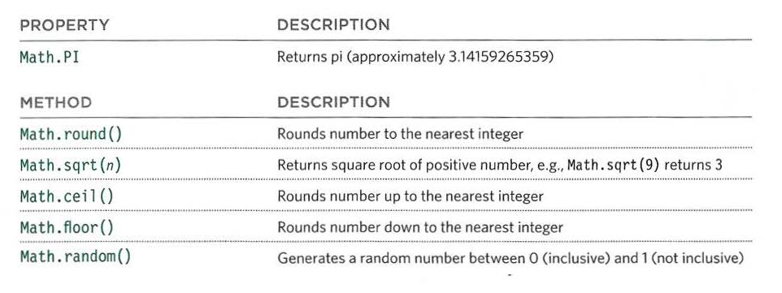
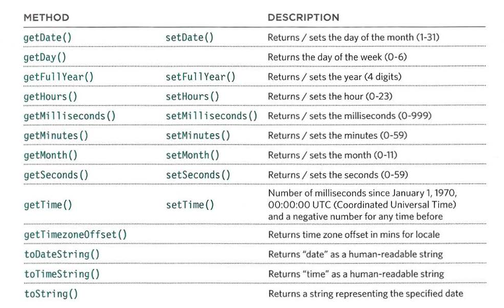

# Object-Oriented Programming, HTML Tables

## Domain Modeling

*Note: all the text in this section was copied from Code-Fellows' "Domain Modeling" repo by Sam Hamm. Read more on this link : [https://github.com/codefellows/domain_modeling#domain-modeling](https://github.com/codefellows/domain_modeling#domain-modeling)*

Domain modeling is the process of creating a conceptual model in code for a specific problem. A model describes the various entities, their attributes, and behaviors, as well as the constraints that govern the problem domain. An entity that stores data in properties and encapsulates behaviors in methods is commonly referred to as an object-oriented model.

A domain model that's articulated well can verify and validate the understanding of a specific problem among various stakeholders. It defines a vocabulary that can be used within and between both technical and business teams as a communication tool.

When building your domain models:

1. When modeling a single entity that'll have many instances, build self-contained objects with the same attributes and behaviors.
2. Model its attributes with a constructor function that defines and initializes properties.
3. Model its behaviors with small methods that focus on doing one job well.
4. Create instances using the new keyword followed by a call to a constructor function.
5. Store the newly created object in a variable so you can access its properties and methods from outside.
6. Use the this variable within methods so you can access the object's properties and methods from inside.

## HTML Tables

A table is a representation of a date in a grid format. Using tables to display certain data types makes it easier for the reader to understand the data since it is shown in a two axes grid. Each block of content in the tables is called a cell, and data is added to the table in the form of rows of cells.

### Creating tables

We create tables using the \<table> tag. We then add rows using the \<tr> tag, and inside each row, we add a collection of table cells using the table data tags \<td>.

```html
<table>
<tr>
<td>15</td>
<td>15</td>
<td>30</td>
</tr>
<tr>
<td>45</td>
<td>60</td>
<td>45</td>
</tr>
</table>

```

We can also specify table heads using the \<th> tags, which can be added to make either rows or column heads. To determine that a table head represents a row or a column, we can use the `scope` attribute with two values: col, row. If there are any empty cells, we still need to add an empty table head to indicate the presence of that empty cell; otherwise, the table will not be rendered correctly.

```html

<table>
<tr>
<th></th>
<th scope="col">Saturday</th>
<th scope="col">Sunday</th>
</tr>
<tr>
<th scope="row">Tickets sold:</th>
<td>120</td>
<td>135</td>
</tr>
<tr>
<th scope="row">Total sales:</th>
<td>$600</td>
<td>$675</td>
</tr>
</table>

```

Sometimes you may need the entries in a table to stretch across more than one column. The colspan attribute can be used on a \<th> or \<td> element and indicates how many columns that cell should run across.

```html

<table>
<tr>
<th></th>
<th>9am</th>
<th>10am</th>
<th>11am</th>
<th>12am</th>
</tr>
<tr>
<th>Monday</th>
<td colspan="2">Geography</td>
<td>Math</td>
<td>Art</td>
</tr>
<tr>
<th>Tuesday</th>
<td colspan="3">Gym</td>
<td>Home Ec</td>
</tr>
</table>

```

You may also need entries in a table to stretch down across more than one row. The rowspan attribute can be used on a \<th> or \<td> element to indicate how many rows a cell should span down the table.

```html

<table>
<tr>
<th></th>
<th>ABC</th>
<th>BBC</th>
<th>CNN</th>
</tr>
<tr>
<th>6pm - 7pm</th>
<td rowspan="2">Movie</td>
<td>Comedy</td>
<td>News</td>
</tr>
<tr>
<th>7pm - 8pm</th>
<td>Sport</td>
<td>Current Affairs</td>
</tr>
</table>

```

You can also add more semantic features to a table using these three tags:

1. \<thead>: for table headers.
2. \<tvody>: for the tables, main data content
3. \<tfoot>: for table footers.

Having these semantics in our code is because sometimes we have tall tables with a huge amount of contents, and you want to keep tracking the table headers and footers, so using these tags, you can add some unique styling and sticky features to the table head and foot.

```html

<table>
<thead>
<tr>
<th>Date</th>
<th>Income</th>
<th>Expenditure</th>
</tr>
</thead>
<tbody>
<tr>
<th>1st January</th>
<td>250</td>
<td>36</td>
</tr>
<tr>
<th>2nd January</th>
<td>285</td>
<td>48</td>
</tr>
<!-- additional rows as above -->
<tr>
<th>31st January</th>
<td>129</td>
<td>64</td>
</tr>
</tbody>
<tfoot>
<tr>
<td></td>
<td>7824</td>
<td>1241</td>
</tr>
</tfoot>
</table>

```

### Some outdated attributes that are replaced using CSS

1. width: to indicate how wide that table should be. It can be used on table or cells
2. cellspacing: to add space inside each cell of the table
3. cellpadding: to create space between each cell of the table
4. border: to indicate the width of the border in pixels, and it can be used with the table or the cells
5. bgcolor: to indicate background colors of either the entire table or individual table cells

## JavaScript Object-Oriented Programming

### creating objects by construction notation

Another way to create the object is using the object constructer and the new keyword.
We declare the variable and assign it to `new Object();.` Then, we can add however many properties and methods to the object using the member operator. We can use this way to add properties and methods to objects created using literal notations as well.

```javascript

var obj = new Object();
object.key1 = 'Value1';
obj.key2 = 123;
obj.method1 = function(){
    do someething;
};
delete obj.key1;

```

You can change the object properties and call its methods using the dot operator.
You can delete the property or method using the delete keyword.

### Using functions to construct many objects

We can use the function constructor notation to create many objects of the same template.

```javascript

function Obj (param1, param2, param3){
    this.key1 = param1;
    this.key2 = param2;
    this.key3 = param3;
    this.method1 = function(){
        do something;
    };
    let variable = new Obj(arg1, arg2, arg3);
}

```

Notice that we created the function with uppercase to remind the programmer that they are using an object constructor, not a regular function, when they want to use the function constructor.

We can create instances of the object using the new keyword and the function name. Then we provide the arguments needed to create the instance of the object. This type of object is needed when you have a complex script that requires you to create object instances in different places, but you do not know where yet.

### (This) Keyword

The This keyword is so versatile depending on where you are using it. If you use it inside an object literal or object constructor, it will refer to the object in which it operates. If you use it inside a global function, it will refer to the document object.


If you reuse that same function inside another object again, this will refer to the new object even if the function was initially created in the global scope.


### Arrays

An array is a collection of related data, similar to the object, but objects have key/value pairs, while arrays have their indices as the keys to the values they hold.

We can place objects inside arrays and vice versa. Since arrays are variables, they can be the value to properties inside an object. Similarly, because objects are a collection of data, and as arrays are containers for data, objects can sit inside arrays as data, and they will have indices as their keys.

### BUILT-IN OBJECTS

They are objects used to facilitate dealing with browsers. They are created once the web page is load. You can use them with the dot notation, and they can convey a lot of information. These objects are:

1. BROWSER OBJECT MODEL: The Browser Object Model contains objects representing the current browser window or tab. It contains objects that model things like browser history and the device's screen.
2. DOCUMENT OBJECT MODEL: The Document Object Model uses objects to create a representation of the current page. It creates a new object for each element (and each individual section of text) within the page.
3. GLOBAL JAVASCRIPT OBJECTS: The global JavaScript objects represent things that the JavaScript language needs to create a model of. For example, there is an object that deals only with dates and times.

*An object model is a group of objects, each representing related things from the real world. Together they form a model of something larger.*

#### Browswer Object Model

It represents the current window and tabs. The topmost object is the window object, and it contains other objects that tell you about the browser window, such as height, width, history, and screen. It also contains some methods like alert, open, and print.


```javascript

var msg = '<h2>browser window</h2><p>wi dth : ' + window. innerWi dth + ' </p>' ;
msg += '<p>height: ' + wi ndow. i nnerHeight + '</p>';
msg += ' <h2>hi story</h2><p>items : ' + window.history.length+ ' </p> ';
msg += ' <h2>screen</h2><p>width : ' + window.screen.width+ ' </ p> ' ;
msg += ' <p>height : ' + window.screen.height + '</p>';
var el = document.getElementByld('info');
el.innerHTML = msg;
alert('Current page : ' +window.location);

```

#### THE DOCUMENT OBJECT

The topmost object in the Document Object Model (or DOM) is the document object. It represents the web page loaded into the current browser window or tab.


```javascript

var msg = '<p><b>page ti t l e: </b>' + document.title + '<br /> ' ;
msg += '<b>page address: </b>' +document.URL+ '<br />';
msg += ' <b>last modifi ed : </b> ' + document. l astModified + ' </p>' ;
var el = document .getElementByld('footer');
el.innerHTML = msg ;

```

#### Global Objects

There are many global objects we can use to write scripts. They contain the primitive data types we can deal with in JavaScript and some objects like Data and Math.

Primitive data types include:

1. String
2. Numbers
3. Booleans
4. Null: a variable with no value - it may have had one at some point but no longer has a value.
5. Undefined: a variable declared, but no value has been assigned to it yet.

In JavaScript, Arrays and Objects are data types because they hold data in key/value pairs. Functions and methods are objects as well, but they are callable.

##### Strings

A string object is a global object because it works anywhere within your script and a wrapper object because it acts as a wrapper around any string value.
Some properties and methods for strings:


Each character in a string is automatically given a number, called an index number. Index numbers always start at zero and not one (just like for items in an array).


```javascript

var saying= 'Home sweet home ';
var msg = '<h2>length</h2><p> ' +saying.length+ '</p>';
msg += '<h2>uppercase</ h2><p>' + saying .toUpperCase() + '</ p>';
msg += ' <h2>l owercase</ h2><p>' + saying.tolowerCase() + '</ p>';
msg += ' <h2>character index: 12</h2><p>' + saying.charAt(l2) + '</p>';
msg += '<h2>first ee</h2><p>' + saying.indexOf( ' ee ') + ' </p> ';
msg += '<h2>last e</h2><p>' + saying.lastlndexOf('e') + '</ p>';
msg += '<h2>character index: 8-14</ h2><p>' + saying.substring(8, 14) + '</ p>';
msg += '<h2>replace</ h2><p>' + saying.replace('me', 'w') + '</ p>' ;
var el = document .getElemen t Byld('info' ) ;
el.innerHTML = msg;

```

##### Numbers

COMMONLY USED TERMS:

* An **integer** is a *whole* number (not a fraction).
* A **real number** is a number that can contain a fractional part.
* A **floating-point number** is a real number that uses decimals to represent a fraction. The term floating point
refers to the decimal point.
* **Scientific notation** is a way of writing numbers that are too big or too small to be conveniently written in
decimal form.


##### MAth Objects

The Math object has properties and methods for mathematical constants and functions.



```javascript

var randomNum = Math.floor((Math.random() * 10) + 1);
var el = document.getElementByid('info');
el.innerHTML = '<h2>random number</h2><p>' + randomNum + ' </p>';

```

##### Data Objects

To create the Data object, we use the `Date()` constructor. I will hold the current data, and then you can specify another time to represent the variable. The data will be stores in numbers, and it depends on the computer clock and time zone to determine the date and time.



A visitor's location may affect time zones and the language spoken. Programmers use the term locale to refer to this kind of location-based information. The Date object does not store the names of days or months as they vary between languages. Instead, it uses a number from 0 to 6 for weekdays and 0 to 11 for the months. To show their names, you need to create an array to hold them.

```javascript
// creating data object
var t oday = new Date();
var year = today .getFullYear();
var el = document .getElementByld('foot er' );
el.innerHTML = '<p>Copyright &copy;' +year+ '</p>';
// working with data objects
var today= new Date();
var year= today.getFullYear();
var est= new Oate('Apr 16, 1996 15:45:55 ' );
var difference= today.getTime() - est.getTime();
difference= (difference/ 31556900000);
var elMsg = document.getElementByid('message');
elMsg.textContent = Math.floor(difference) + ' years of online travel advice';

```
