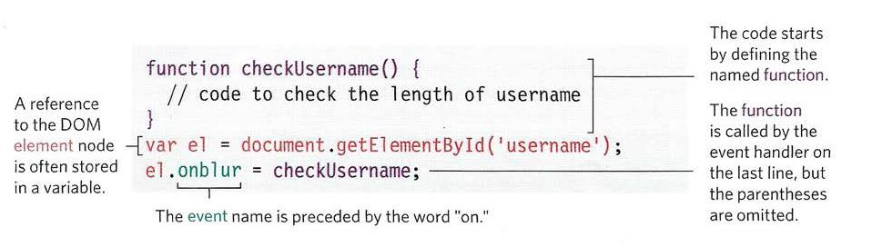
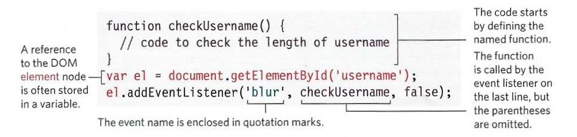
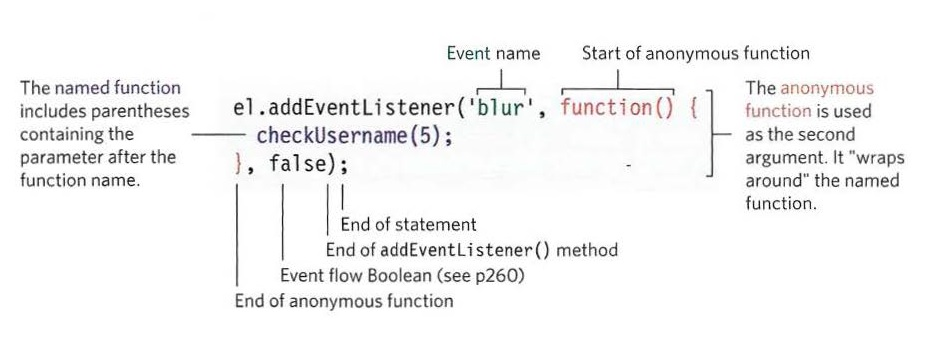

# Forms and Events

## JavaScript: Events

When the user is on a web page, they interact with elements on the browser windows. These elements could be related to the window itself or the web page document. Either way, the user creates events. Subsequently, events trigger a script that could be a function written in JavaScript in response to the event, and this causes change or update on the web page contents or style.

### Event types:

Events are sorted into different categories according to their nature: 

* UI events: occur when the user interacts with the user interface rather than the web page.
* Keyboard events: occur when the user interacts with the keyboard.
* Mouse events: occur when the user interacts with the mouse or trackpad.
* Focus event: occur when an element gains or losses focus.
* Form events: occur when the user interacts with the form elements.
* Mutation events: occur when the 
* Mutation events: occur when the DOM structure has been changed

### How the workflow is done

These are steps how the workflow goes on a web page:

1. The user interacts with the page, so they *raise* an event, or the event is fired.
2. The event *triggers* a script or functions using an *event handler*
3. The script makes changes, so it causes a response

### Event handling

The event handler is how the trigger is made when an event occurs. These steps are included:

1. Node selection
2. Binding an event to the node
3. Call the code

### Binding an element to the event

There are three types of event handling tools you may use to bind events to elements:

#### HTML Event Handler

This handler is outdated now, and it is bad practice to use it. It uses special attributes with the HTML elements once they are created. These attributes are specified by typing the event's name preceded by the word on, and the value is the function to be triggered.

#### Traditional DOM Event Handler

It is better to use this handler instead of the HTML handler because it lets you separate the JavaScript from the HTML. It is a very powerful tool that is supported by all major browsers. However, it does not support multi-event handling, and you are only limited to bind one event to an element.

To use this handler, you first need to declare a function to use on the element when the event fires. Then you type the handler with the event name and the function name without the parenthesis. 

#### Event Listener

It is the best way to bind events and scripts because it allows multiple binding. It does not work with IE8 or earlier versions. These listeners are supported by the DOM; it is a method that is related to the DOM elements. Before you write an event listener, two things are put in place: 

1. If you use a named function when the event fires on your chosen DOM node, write that function first. (You could also use an anonymous function.)
2. The DOM element node(s) is stored in a variable.

*Note*: you don't need to precede the event's name with the word on with the event listener.

If you need to pass arguments to a function called by an event handler or listener, you wrap the function call in an anonymous function.

To support old browsers like IE8, which does not support the event listeners, we use a special method called attachEvent(). We usually include an if statement to make the script adapt to all browser versions.

    