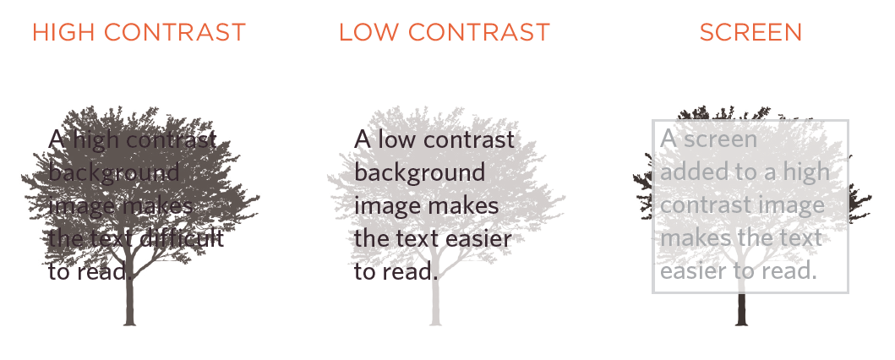

# CSS Images and Practical 

## CSS Images and

### Images Sizes and Alignment

We can resize images using the height and width properties. When doing so, we help the page load faster and smoother. Instead of specifying images sized individually, you can create three categories: small, medium, large, and then you can apply it to your images in the class name, so you only need to write CSS the code once.

#### Images Alignment

To align images, you can also do that in two way:

1. Add the float property to the sizing code that uses the class selector.
2. Use new class names such as left and right and use the float properties inside the new class selector for the new class name.

#### Centering Images

Images are inline elements by default; therefore, you need to change their state to block so you can align them in two ways:

1. You can use the `text-align` property and make it center on the containing element.
2. You can use the `margin` property and set left, and right offsets auto.

### Background Images

The background-image property allows you to place an image behind any HTML element. By default, a background image will repeat to fill the entire box.

#### Background Image Repeat and Attachment

Since the background image can be small and repeat to spread around the whole containing element, you can specify the repeat property. It may have four values:

1. repeat: this is the default, and the image will be repeated across the whole element.
2. repeat-x: this will repeat only along the x-axis or horizontally.
3. repeat-y: this will repeat only along the y-axis or vertically.
4. no-repeat: the image will show only once.

We can specify the attachment property, so the background has different behaviors:

1. fixed: the image stays in the same position.
2. scroll: the background image will move up and down while the user scrolls the page.

#### Background positioning

When an image is not being repeated, you can use the background-position property to specify where the background image should be placed in the browser window. This property usually has a pair of values. The first represents the horizontal position, and the second represents the vertical.

*Note*: If you only specify one value, the second value will default to center. You can also use a pair of pixels or percentages. These represent the distance from the top left corner of the browser window (or containing box).

#### Shorthand background

The properties must be specified in this order:

1. background-color
2. background-image
3. background-repeat
4. background-attachment
5. background-position

CSS3 will also support the use of multiple background images by repeating the background shorthand.

#### Image Rollover and Sprits

When we use different images to style a single element in different states, this is called Rollover. When we use one image and change its position to indicate different states of the element, it's called Sprite. The advantage of using sprites is that the web browser only needs to request one image rather than many images, making the web page load faster.

```CSS

a.button {
height: 36px;
background-image: url("images/button-sprite.jpg");
text-indent: -9999px;
display: inline-block;}
a#add-to-basket {
width: 174px;
background-position: 0px 0px;}
a#framing-options {
width: 210px;
background-position: -175px 0px;}
a#add-to-basket:hover {
background-position: 0px -40px;}
a#framing-options:hover {
background-position: -175px -40px;}
a#add-to-basket:active {
background-position: 0px -80px;}
a#framing-options:active {
background-position: -175px -80px;}

```

#### Backgorund Gradients

It is allowed to add color in gradient to any element. It represents the hues of colors from one side of the image to another. We specify different colors, and the gradient will be the range of colors that comes between them. 

```CSS

#gradient {
/* fallback color */
background-color: #66cccc;
/* fallback image */
background-image: url(images/fallback-image.png);
/* Firefox 3.6+ */
background-image: -moz-linear-gradient(#336666,
#66cccc);
/* Safari 4+, Chrome 1+ */
background-image: -webkit-gradient(linear, 0% 0%,
0% 100%, from(#66cccc), to(#336666));
/* Safari 5.1+, Chrome 10+ */
background-image: -webkit-linear-gradient(#336666,
#66cccc);
/* Opera 11.10+ */
background-image: -o-linear-gradient(#336666,
#66cccc);
height: 150px;
width: 300px;}

```

#### Contrast

If you want to add text to the background image element, you have to care about the contrast between the image and the text. Because images usually have high contrast, we need to modify their color before using them as background images.

