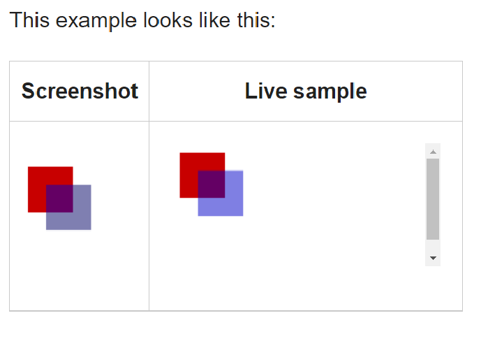

# Canvas and Chart.js

## What is canvas?

\<canvas> is an HTML element, kind of similer to \, but it has a closing \</canvas> tag and it does not have `alt:`attribute. It is used to draw shapes, charts, diagrams, or anything that has context. The \<canvas> element has attributes to control ots width and height, which are the most important attributes for it because without specifying these two attributes the draw will be ruined. 

All major browsers support the canvas element although older ones like IE8 or earlier don't. Therefore, we need to add a fallback code so if the user is still using these browsers they will still see an alternative. Also the methods sued in canvas we can include if statement to check the users' rendering capabilities and write a fallback code to support them.

```html
<canvas id="stockGraph" width="150" height="150">
  current stock price: $3.15 + 0.15
</canvas>

<canvas id="clock" width="150" height="150">
  
</canvas>

```


When adding a canvas element, we have to give it an ID attribute so it will be easy on javascript to recoognize the element. Then, we need to give it a context, which is a method that accepts only one value that gives the element the basement to draw shapes and other things. There are many different values that could go inside the method, but most basic one is 2d, which allows us to draw two dimensions shapes. We,also, can check for the support and add a fallback code toc check availability. \<canvas> also takes border, margin, and padding, and it is a good idea to style it using them.

```javascript

var canvas = document.getElementById('tutorial');

if (canvas.getContext) {
  var ctx = canvas.getContext('2d');
  // drawing code here
} else {
  // canvas-unsupported code here
}

```

If we don't provide information to the canvas element that tells it what to draw the result will be empty, transparent box, occuoying the area of size we previously specified. To give information to the element we add write them to the context element using different methods `fillStyle` and `fillShape`.

```javascript

    var ctx = canvas.getContext('2d');
    ctx.fillStyle = 'rgb(200, 0, 0)';
    ctx.fillRect(10, 10, 50, 50);
    ctx.fillStyle = 'rgba(0, 0, 200, 0.5)';
    ctx.fillRect(30, 30, 50, 50);
    

```

