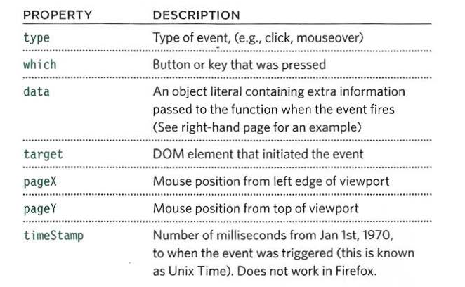

# jQuery and Pair Programming

## jQuery

jQuery is a Javascript library that contains complex code with a simpler interface that allows users to write Javascript code more easily and shorter lines of code.

jQuery has many features that make it preferable to use on vanilla Javascript coding:

* Select elements in easier and more accurate ways using CSS style-selectors.
* Manipulate and modify elements using methods that are way shorter and neater than DOM.
* Straightforward event listeners that are easy and short.
* simplified versions of some animations that are written on one line.

Using jQuery, we save references to HTML elements into variables using the shorthand $() function. Then we use the implemented methods to do actions on these elements. This way is much more efficient than capturing objects every time we want to perform a method on them; that is, it will decrease the overhead of searching and filtering the HTML elements during the selection process. This process is called CACHING.

We can traverse over selected items using implicit iteration instead of writing loops.

We can chain more than one method on one line, which means we can perform multiple methods at a time without writing much code.

jQuery is a library that can be used across all browsers without taking care of fallback code since it will take care of it.

We have to include the jQuery file in our HTML file before the JS file that uses it.

There are different versions of jQuery, and we have to decide which one to use according to the complexity of our project and the features we need to implement. A version contains the full code with the fallback code that supports older browsers, but it is heavier and larger. There is another version that drops down support to older browsers which contain only the important features that work on the most major browser. This version is lighter and smaller in size, which makes the including process faster.

jQuery has unique ways to select, manipulate, and styling elements. Combining the pure JS code with jQuery opens all possibilities.

When we use jQuery selectors, we either select one element or multiple elements that match the selection. The result is an array that holds a reference to these elements, which we call a matched set. If no element matches the selection, it will return null, not an error. Then we can apply methods to the elements inside the array. If there is more than one element in the array, we don't need to write a loop to traverse over them; we rather write the method, which will perform an implicit looping and apply the changes to every element of the array. For getting or retrieving data from the selection set, the methods will not traverse through all the elements, and only the value of the first element will be retrieved. If we want to get all elements' values, we need to use methods like `.each()` or `.filter()` to achieve this purpose.

### How to use jQuery

This is how to use the library and its methods and functions to work with HTML and CSS elements:

#### Checking the file is ready to work with

This is a great way to check if the document object is already loaded and ready to interact.
We achieve that using: `.ready`.

```javascript
$(document).ready(function(){
    //here script
});
```

Or, better, we can use the shorthand:

```javascript
$(function(){
// script here
});
```

One advantage to use it: it creates function-level scope that prevents naming collisions with other libraries.

#### Getting element content

We can use two methods to get elements content. Depending on our need, we can use the `.html()` method to get content with tags and markups, or we can use the `.text()` method to get only the text that resides inside the tag without any markups or tag notations.

#### Updating elements

If we add string parameter to the `.html()` and `.text()` methods, we can update the content of the element. There are two more ways, which are the
`.replaceWith()` method and `.remove()` method. We can use functions that return the element inside the parameters parentheses.

#### Inserting elements

To insert element inside the document. We need to create the element we want to add first, then we use one of the methods to insert the element according to the position to which we want to insert it. These methods are `.append()`, `.prepend()`, `.before()`, `.after()`, `.appendTo()`, and `.prependTo()`.

```javascript

let $newEl = $('<li>Newly created item</li>');
$('list').append($newEl);

```

#### Getting and Setting attributes

`.attr()` method is used to capture attributes of an element. We specify the attribute we want inside the parameter parenthesis. We can set the attribute by adding a comma and the value of it as a second parameter.
`.addClass()` method adds a class name inside the class attribute list.
`.removeAttr()` method to remove a specific attribute named written inside the parameter parentheses.
`.removeClass()` method to remove class from the class list if it exists.

#### Getting and Setting CSS properties

`.css()` method is used to get the value of a specific CSS property we specify inside the parentheses. Also, we can set the property by adding a comma and a second parameter representing the value of the property. If we want to set more than one CSS property, we can add them inside curly braces with properties written separated by a comma when dealing with dimensions that are specified in pixels. You can increase and decrease the values using the+= and-= operators.

#### WORKING WITH EACH ELEMENT IN A SELECTION

Sometimes we need to perform more than one action on a collection of elements, which can not be possible with regular method calls. We instead use the `.each()` method, which takes one parameter; a function contains actions and statements to be applied to the element.

#### Events

To add an event listener, we use the `.on()` method, which takes two parameters; the first is the event's name. We can specify multiple events separated by a space; the second is the event handler's function.

```javascript

$(function(){
$listltems.on('mouseover click', function()
ids= this.id;
$listltems.children('span').remove();
$(this).append(' <span class="priori ty">' +ids+ '</span>');
});

```

#### The event object

Like vanilla Javascript, the event handler in jQuery takes event objects with different properties and methods that could be used inside the event handler function.



#### Additional parameters for event handlers

The • on () method has two optional properties that let you: Filter the initial jQuery selection to respond to a subset of the elements; Pass extra information into the event handler using object-literal notation `.on(events[, selector][, data], function(e) );`.

### Where to get and include jQuery file

We can download a copy of the jQuery file from the official website or get a link from a CDN and include it inside our HTML file. It is better to include a fallback link to the file from our server because the CDN might go down or travel files to different networks.

The best place to include the link to the jQuery file is at the bottom of the HTML file before the body tag closed.

## Pair Programming

Pair programming is a strategy utilized by working areas that adopt agile. It involves two people working on the same project and tackle the same problems. Using pair programming, since each programmer has their coding style, the collaboration will result in a more efficient and higher quality code. Problems will be solved faster, and when debugging, two people will be able to debug the code and get the job done in a shorter time.

Pair programming requires two people working on the same code feature or problem. One of them is called the driver, who writes the code and interprets what the other programmer tries to explain. The other is called the navigator, who guides the driver throughout the code, watching and thinking more than typing and testing, the thing that allows them to be more careful and able to spot errors and coding mistakes instantaneously.

### Why pair programming

* Better efficiency: this means that two people will tackle problems and bugs when two programmers are working on the same project simultaneously. Doing this will take a slightly longer time, but it will leave the code working better than when only one programmer has written it.
* Engaged Collaboration: when two programmers are working together, and each one relies on the other, it will decrease distraction and procrastination.
* Learning from fellow students: when one of the programmers has more knowledge than the other, by explaining problems, the other programmer will learn new concepts and new things, the one who has more knowledge will solidify their knowledge more.
* Social skills: pair programming teaches teamwork and gives programmers a chance to develop their communication skills.
* Job interview readiness
* Work environment readiness
