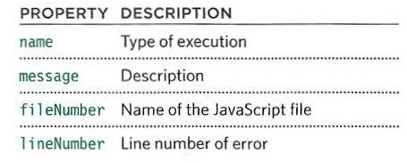

# THE CALL STACK

To understand the call stack, we have to learn more about Javascript interpreters where we execute our code. Let's take a look at the JavaScript interpreter in the browser. It has a heap memory and a memory allocated for the call stack. The interpreter is single-threaded, which means that it can only perform a single task or command at a time. This makes function execution synchronous. 

The call stack is where the JS interpreter manages all the functions that get called. Suppose there is a function that inside it, has a call to another function. The new function will be allocated a new memory over the previous one called the stack frame. In the stack frame, all argument, variables, and the code to execute the function are held. Only after the call to the later function is finished, when all code and operations are executed, the function gets popped off the stack, and the control will go back to the function that called it. 

The call stack is mainly a data structure following the LEFO principle in dealing with the data inside it. The data it holds is functions, whether they could be callback functions or invoked functions. The interpreter saves the memory location for each function and executes them as intended. 

*Stack Overflow**: if an error happens when the memory allocated to the stack area is filled with function calls, there is no more space for another function call. This error commonly happens with recursive functions, which are functions that call themselves from inside. If no endpoint terminates every new call, the stack will flow with function calls inside it, causing the program to freeze and stop execution.

## Error Handling

Error objects can help you find where your mistakes are and browsers have tools to help you read them. When an Error object is created, it will contain the following properties:

There are seven types of built-in error objects in JavaScript:

