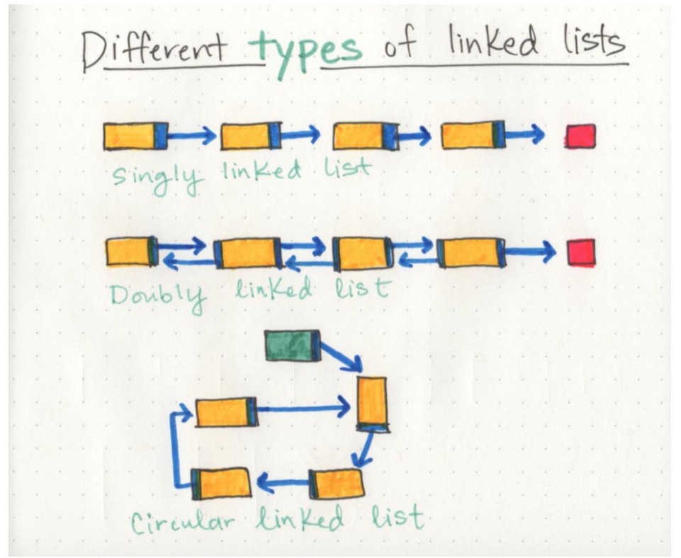
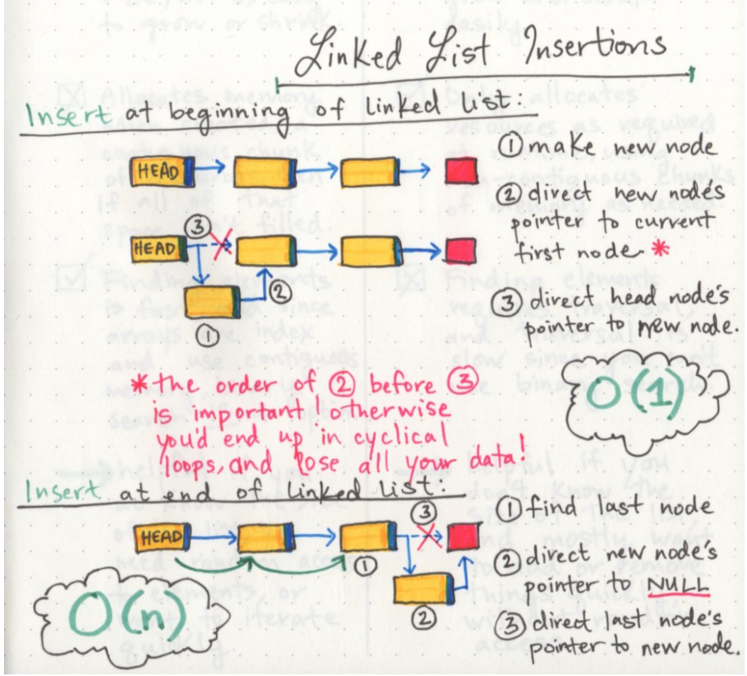

# Linked Lists

A linked list is a data structure used in programming that has many advantages and disadvantages. Another data structure is the array that needs to store data contiguously in the memory. So, it needs to allocate a block of memory for the data inside the array. Arrays are static data structures that mean that the processor must know how much memory it needs to allocate for the array before runtime. Therefore it is not efficient to use when we need a growing data structure that continuously needs memory allocation and shrinking. Thus, the linked lists came to solve this problem with more flexibility and dynamic behavior.

Linked lists are mainly a linear data structure that consists of arranged nodes. Each node contains a specific type of data and a reference to the next node in the list, which, as well, contain data and a reference to the next. Having this reference element allows each node to live wherever a place is available in the memory. Linked lists, as a result, don't have to allocate blocks of memory before runtime. They instead allocate only memory needed for the data they contain whenever needed by the user or the program during the runtime.

This is a very efficient approach when we want to add and delete our application's collection of data. But linked lists are not suitable for all kinds of programming. They are very slow if we want to search and traverse through the application's data because it is not contagious in the memory, and we need to transit between references until we reach the last or the item we want to search for. We cant perform binary search on linked lists.

List of the differences between linked lists and arrays:

| Linked lists                                                                       | Arrays                                                                 |
| ---------------------------------------------------------------------------------- | ---------------------------------------------------------------------- |
| Inserting and deleting is very fast                                                | Slow writing and deleting process                                      |
| Searching is slow                                                                  | Faster search since it supports binaty search                          |
| Dynamic size                                                                       | Static, less flexible size                                             |
| Allocating memory as required at runtime                                           | Contagiuos chunks of memory allocated when created                     |
| Helpful when you don't know the size of the array and you don't need random access | Helpful when you need random access and you know the size of the array |
