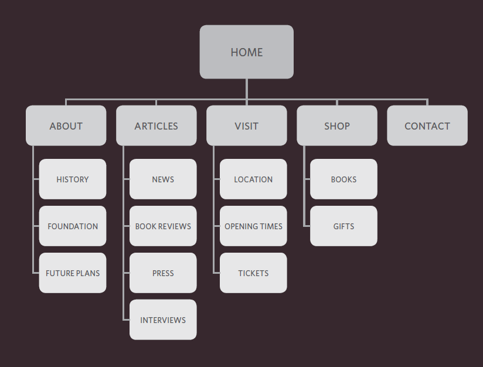
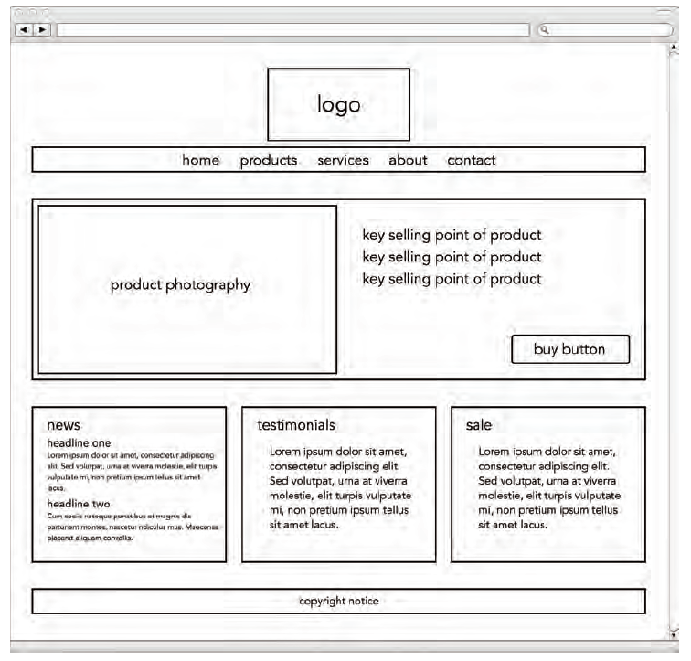

# Process and Design

In this chapter, you will learn how to design and structure your web page, who will be your target audience, and the key features your website should have to fulfill their needs. 
When you want to build a website, you have to think deeply about who will visit it and why. This will help you figure out what content you should put on your website and the most important features you have to provide. Usually, people will be visiting your website for specific goals, and these goals are different from one to another. Therefore, considering different types of people, their age groups, marital status, occupation, working hours, income, and many more criteria will help you strengthen your website structure and build a more robust and appealing design.
## Understanding your target audiences and the purpose behind your site:

Below are some essential standards you may follow to build a supper website:
### Who is the site for?
You have to remember that the site is not only for you or its owner. So, you have to think about who is your targeted audience. They could be either individuals or companies; so, let us explore what is essential to know about each group.
#### Individuals:
You should have answers to many questions about individuals: what is your target audience's age range? And in which country do they live? What do they work? How long do they spend on the web? How much income do they receive? Are the majority of them male or female? 
#### Companies:
Usually, you will not have a lot of questions when you deal with companies. You should mainly know how big the company is, and who is the person interested in using your site? How big is their budget? And would they use your site for their personal use or someone else? 
### Why will people visit your website?
Some people will visit your site by chance; others will have particular purposes from visiting your site. Thus, you have to know what they aim for when visiting your site. You can have a good idea of them by considering two main aspects: 
#### What is the motivation that drives them to come to your site: 
Is their motivation only for entertainment or special goals? If their goals are personal or professional and if they are essential or luxury.
#### What are these specific goals that make them come to your site:
There are many goals people might seek in your site; for example, are they looking for information about a product? Do they want to read sensitive information like the news? Are they looking for educational material or scientific articles? Is it vital for them to inform you or contact you? 
### What your visitors are trying to achive?
You first need to create a list of all possible goals visitors could come to your site for, then write a new plan for the functionalities and features your site must offer to achieve these goals. 
### What information your visitors need? 
When you have finished listing all your visitors' goals and how to achieve them, you now need to think about the information you must give to achieve their goals quickly and effectively. You may provide the information from the most important to the least. You may also hide some intuitive information and provide the most relevant ones. And most importantly, will they have additional questions once they achieved their desired goals?
### How often will people visit your website?
Some websites need to be updated regularly. Depending on the service you sell from your website, you can decide when you will be updating the contents of your website. It is best practice to set a schedule for the times your website will need to be updated. 
## Structure phase:
Now that you know everything about people who will visit your website and all functions, features, services, and information your site should provide, now you can start building the general site structure and the pages you need to make your site.
### Site map:
It is a diagram that shows all your site pages. Each page should contain related content and information. If you have a bunch of pages that are relevant to each other, you may bundle every group into one section where each section contains several pages that have a common purpose. 
The site map will always begin with the homepage and branching from it, all other sections. Then down the hierarchy, you will add all pages related to each particular section.
Example site map sketch:

### Wireframe:
A wireframe is a simple sketch of the key information that needs to go on each page in a site. It shows the hierarchy of the information and how much space it might require.
It should not include visuals and colors but rather the page's main components and how information is presented. It is helpful to show pages' wireframes to the client before designing the website to make sure it offers all functions and the information is shown in the right way.
 
### Getting your message across using design:
The primary aim of any visual design is to communicate. Organizing and prioritizing information on a page helps users understand its importance and read it in.
Some web pages contain plenty amount of content and information. Hence, designers need to manage these components according to special roles.
#### Prioritizing:
Making different parts of the page look more distinct than others, we can grab the viewer's attention to the content of high importance and emphasis, and from there, it can guide them to less important content. Besides, designers create something known as a visual hierarchy that helps users find key content.
#### Organizing:
It is, mainly, grouping related content together into blocks and chunks. It also aims to present related items or types of information in a similar visual style. That will help users associate the style with a particular kind of content.
### Visual hierarchy:
Most web users do not read entire pages. Instead, they skim to find information. Visual hierarchy refers to the order in which your eyes perceive what they see. It is created by adding visual contrast between the items being displayed. Achieving a fair hierarchy requires balance.
Four vital standards to make the visual hierarchy:
#### Size
Larger elements will grab users' attention first.
#### Color
Foreground and background color can draw attention to key messages.
#### Style	
An element may be the same size and color as surrounding content but have a different style to make it stand out.
#### Images
Images create high visual contrast and often attract the eye first. They can be used to draw attention to a specific message within the page.
### Grouping and similarity
Grouping related pieces of information together can make a design easier to comprehend.
